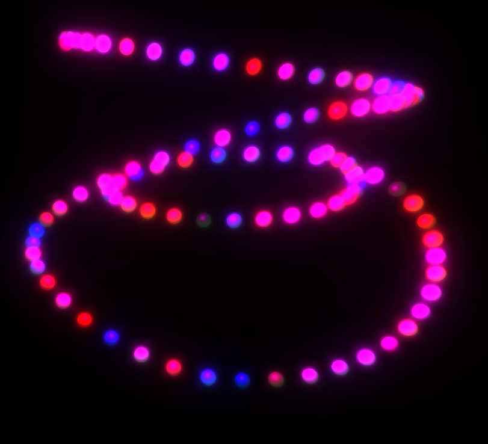

# Glowpen

Three.js app where you can draw with your mouse

## Installation

go to client folder:

`cd client`

download dependencies:

`npm i`

run vite app:

`npm run dev`

## License

This project is licensed under the terms of the [MIT](https://choosealicense.com/licenses/mit/) license.
